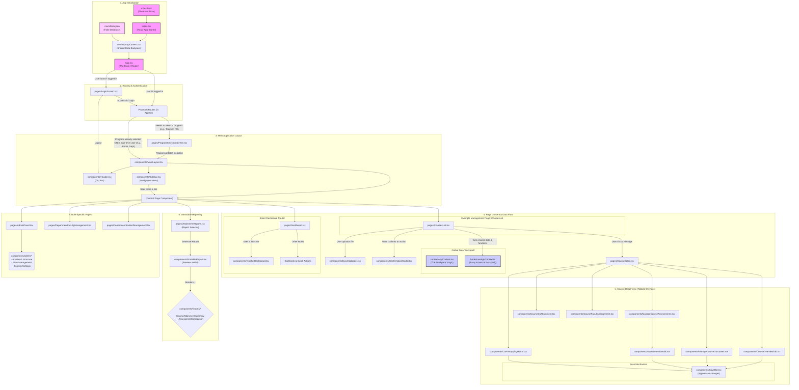

# Application Flowchart

This flowchart visualizes the structure and data flow of the NBA OBE Portal application. It shows how files are connected, how data is shared, and how users navigate through the app.

